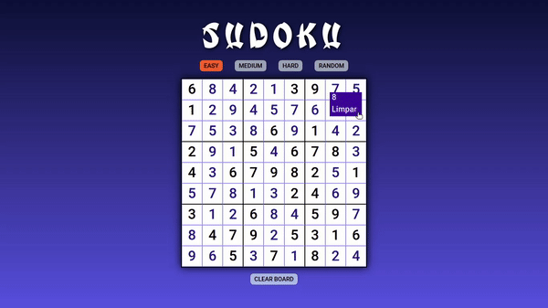

# Sudoku  :pencil: 

##  Gosto muito de sudoku! E através desse projeto de iniciativa pessoal, além de colocar em prática alguns dos conhecimentos que adquiri, também pude ter a satisfação de construir algo que costumava consumir nos intervalos dos estudos.

 

 
 <a href="https://gonzagadavid.github.io/sudoku/">Página do Projeto<a>
 
### Características do projeto:

- Os elementos html são construídos dinamicamente através do JavaScript;
- Os jogos são adquiridos através da API(https://github.com/bertoort/sugoku), como um array de arrays, conforme o nível de dificuldade escolhido pelo usuário;
- Através do desse array de arrays recebido, o card do jogo é criado dinamicamente;
- Ao clicar em um dos espaços a serem preenchidos, é verificado as opções de números para o mesmo lugar e renderizado como opção;
- Quando escolhido um número pelo usuário, o seu local no array também é atualizado, e verificado se o preenchimento está completo;
- Ao clicar no botão clearboard o card será limpo somente no lugares preenchidos pelo usuário, proporcionando uma nova tentativa.

Espero que tenha jogado, finalizado e gostado da experiência!

### Obrigado pela visita! Se gostou, por favor, não se esqueça da :star: motivacional :grimacing:
